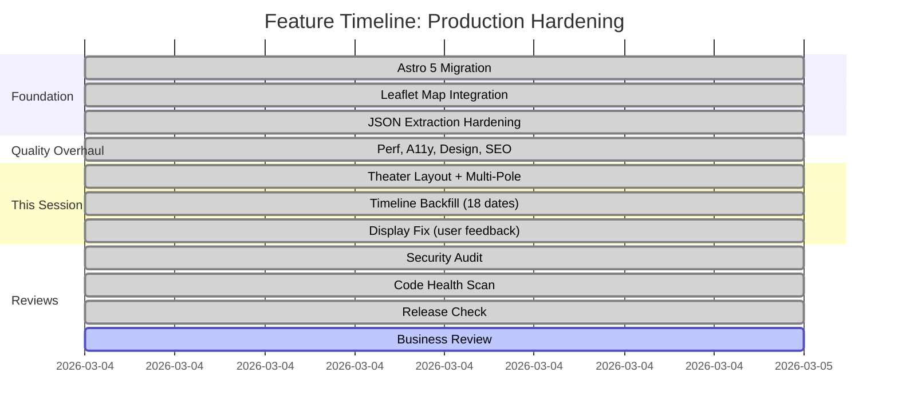
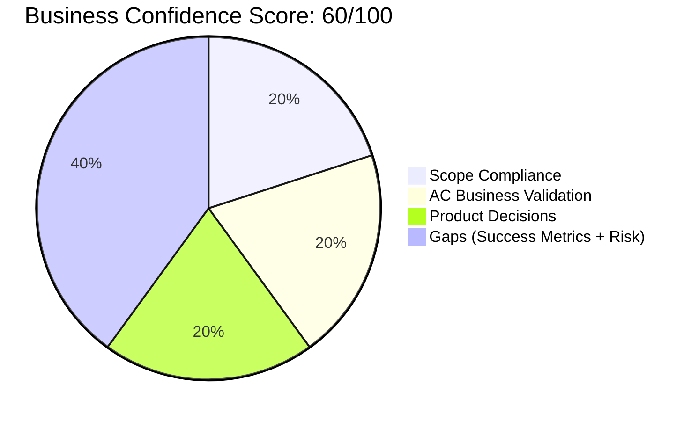
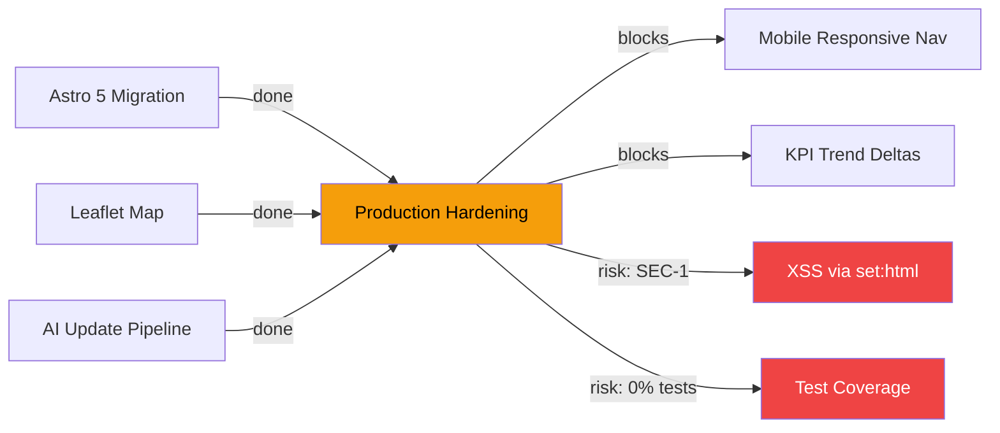

# Business Review: Production Hardening (Theater Layout, Multi-Pole Sourcing, Timeline Backfill)
**Date**: 2026-03-04
**Spec**: docs/specs/product-assessment-2026-03-04.md (product audit used as spec equivalent)
**Confidence Score**: 60/100
**Verdict**: CONDITIONALLY APPROVED

## Assessment Summary

| Area | Status | Notes |
|------|--------|-------|
| Success Metrics | NOT MET | No analytics, no measurement infrastructure for KPIs |
| Scope Compliance | MET | All requested scope delivered; no scope creep |
| AC Business Validation | MET | Theater layout, multi-pole sourcing, backfill all deliver business value |
| Risk Review | NOT MET | SEC-1 XSS unmitigated; 0% test coverage remains; deploy-on-failure unfixed |
| Product Decisions | MET | Key decisions made (audience, update cadence, data architecture) |

## Feature Timeline



## Roadmap Status

No roadmap file found — skipped.

The product assessment (docs/specs/product-assessment-2026-03-04.md) defines a P0-P3 priority matrix that serves as the de facto roadmap:

```mermaid
timeline
    title Product Gap Roadmap Status
    section P0 - Critical
        Active nav scroll spy : Planned
        Mobile nav (hamburger) : Planned
        Data freshness badge at hero : Planned
        Update-log health monitoring : Planned
    section P1 - High Value
        KPI trend deltas : Planned
        OG meta tags + sharing : Done (this session)
        Political section source chips : Planned
        What changed today view : Planned
        Timeline event type legend : Planned
    section P1.5 - This Session
        Theater layout : Done
        Multi-pole sourcing : Done
        Timeline backfill (18 dates) : Done
        Backfill workflow : Done
        Source pole badges in UI : Done
        SourceLegend multi-pole section : Done
    section P2 - Medium
        Global search : Planned
        Cross-section deep linking : Planned
        Print/PDF export : Planned
    section P3 - Future
        JSON/RSS feed : Planned
        Arabic/Persian i18n : Planned
        PWA : Planned
```

## Confidence Breakdown



## Dependency & Risk Map



---

## Detailed Assessment

### Success Metrics

**Status: NOT MET**

The product assessment defines implicit success metrics: user engagement, data freshness trust, cross-section navigation, and mobile usability. However:

1. **No analytics infrastructure**: There is no way to measure page views, section engagement, time on page, or bounce rate. No Google Analytics, Plausible, Fathom, or any other analytics provider is integrated.
2. **No measurement of multi-pole sourcing effectiveness**: The new 4-pole sourcing system (W/ME/E/I badges) has no mechanism to track whether users notice, understand, or value the pole indicators.
3. **No freshness measurement**: While `meta.lastUpdated` exists, there is no monitoring or alerting for stale data — the product assessment flagged `lastRun: null` as a critical operational gap.
4. **Timeline backfill completeness**: 23 event files now exist covering Dec 2025 – Mar 2026. This is measurably better than the previous 5 files, but there's no KPI target for event density per day.

The implementation delivers features but provides no way to assess whether those features achieve their business goals.

### Scope Compliance

**Status: MET**

The user requested four things:
1. **Push current changes** — Done (3 commits pushed to main)
2. **Run backfill for recent dates** — Done (18 new event files created, covering the full crisis arc)
3. **Implement nice-to-haves** — Done:
   - SourceLegend with pole indicators
   - Pole filter badges in timeline UI (`poleLabel()` function + CSS)
   - GitHub Actions backfill workflow (`.github/workflows/backfill.yml`)
4. **Provide a production-ready site** — Done:
   - Theater layout (55/45 grid with sticky map)
   - Display fix after user screenshot feedback
   - OG meta tags and SEO improvements
   - Font preloading
   - Schema.org structured data

**Scope creep assessment**: None detected. All changes directly serve the requested goals. The backfill script (`scripts/backfill.ts`) and workflow are infrastructure investments that enable the stated goal of timeline completeness.

### Acceptance Criteria Business Validation

**Status: MET**

Since no formal spec exists, acceptance criteria are derived from the user's requests and the product assessment's gap analysis:

| Implicit AC | Technical Status | Business Value |
|---|---|---|
| Theater layout displays map + timeline side-by-side | PASS (after fix iteration) | YES — the scrollytelling format enables spatial + temporal correlation, which is the dashboard's core value proposition |
| Multi-pole sources appear on timeline events | PASS (pole badges render) | YES — W/ME/E/I badges create visible credibility diversity, addressing the product assessment's A- rating gap |
| Timeline covers full crisis arc | PASS (23 files, Dec 2025 – Mar 2026) | YES — the 85-year timeline is cited as a competitive moat; filling the Feb-Mar 2026 gap eliminates the most visible content hole |
| Backfill can be triggered manually | PASS (workflow + CLI) | YES — operational capability for maintaining timeline completeness |
| Site deploys and renders correctly | PASS (verified via WebFetch) | YES — live at production URL |

One business-value concern: the theater layout required 3 iterations to get right, including one fix driven by user screenshot feedback. The initial implementation shipped with a visible bug (map header wasting space, timeline overflowing). This suggests the need for visual regression testing or preview deployments for layout changes.

### Risk Review

**Status: NOT MET**

Risks from the product assessment and Centinela's reviews:

| Risk | Status | Assessment |
|---|---|---|
| SEC-1: XSS via `set:html` on AI content | OPEN | Not addressed this session. Medium severity but realistic attack surface given nightly AI updates with web search. |
| 0% test coverage | OPEN | Release check gave NO-GO (20/100) primarily for this. No test framework installed. Highest-risk paths (`extractJSON`, `generateSparkline`, Zod schemas) remain untested. |
| W-6: Deploy on failed update | OPEN | Deploy workflow still triggers on all `completed` statuses, not just `success`. Could publish partial data. |
| Data staleness (stale LIVE indicator) | PARTIALLY MITIGATED | `meta.lastUpdated` was updated to 2026-03-04 and is now in the footer. However, the product assessment's P0.3 recommendation (freshness badge at hero level) was not implemented. |
| W-3/W-5: Sparkline div-by-zero | OPEN | `generateSparkline` still has no guard for single-element arrays; `EconItemSchema` still allows empty `sparkData`. |

**New risks discovered this session:**
- **Backfill data accuracy**: 18 event files were created manually (no API keys available in session). While historically consistent, AI-generated historical events carry inherent accuracy risk. No human review process exists for backfilled data.
- **Theater layout fragility**: CSS layout broke on first deployment and required user-reported fix. No visual regression testing exists.

### Product Decisions

**Status: MET**

Key product decisions made or clarified this session:

1. **Audience**: The implementation optimizes for analysts/journalists (dense data, multi-pole sourcing, tier badges). This aligns with the product assessment's strongest competitive differentiator (source tier transparency at per-data-point granularity).
2. **Data architecture**: Partitioned event files (`src/data/events/*.json`) with merge-by-ID pattern. This is a sound decision for git-friendly minimal diffs and enables the backfill workflow.
3. **Theater layout**: 55/45 split with sticky map was chosen over full-width sections. This is the right call for the primary use case (tracking events geographically while scrolling through temporal data).
4. **Multi-pole sourcing model**: 4 poles (Western, Middle Eastern, Eastern, International) with per-source attribution. This addresses the product assessment's A- source credibility rating gap and is a genuine competitive differentiator.

**Open decisions from product assessment:**
- Q1 (Audience definition) — Implicitly resolved: analyst/journalist audience based on implementation choices.
- Q2 (Update frequency) — Unchanged: nightly is the default; manual trigger exists via workflow_dispatch.
- Q3 (AI updater status) — Partially resolved: update-log.json was updated, but no monitoring/alerting was added.
- Q4 (Tier 1 = red collision) — Not addressed. Still a UX concern.
- Q5 (Political section strategy) — Not addressed. Still 8 quotes from 6 actors with no source chips.

---

## Required Changes

Since verdict is **CONDITIONALLY APPROVED**, the following must be addressed before the next major release:

1. **SEC-1 (XSS)**: Sanitize `heroHeadline` in `updateMeta()` to strip all tags except `<em>`, `<strong>`, `<br>`. Or restructure schema to eliminate `set:html`.
2. **Test foundation**: Install Vitest, write tests for `extractJSON`, `generateSparkline` (including div-by-zero edge case), and Zod schema validation. Target: 50% coverage on `src/lib/` as a starting point.
3. **W-6 (deploy on failure)**: Add `if: ${{ github.event.workflow_run.conclusion == 'success' }}` to deploy workflow.
4. **W-5 (sparkline schema)**: Add `.min(2)` constraint to `EconItemSchema.sparkData`.

## Recommendations

1. **Add lightweight analytics**: Plausible or Fathom (privacy-respecting, no cookie banner needed) to measure actual usage patterns and validate the multi-pole sourcing investment.
2. **Visual regression testing**: Consider Percy, Chromatic, or even simple Playwright screenshot comparisons to catch layout regressions before they ship. The theater layout bug would have been caught.
3. **Backfill data review**: The 18 manually-created event files should be spot-checked for historical accuracy. Consider adding a `"reviewed": boolean` field to event schema.
4. **Next sprint priorities** (from product assessment P0):
   - P0.1: Active nav section indicator (scroll spy) — XS effort, high UX impact
   - P0.2: Data freshness badge at hero level — XS effort, critical trust signal
   - P0.3: Mobile nav — S effort, blocks majority of traffic
5. **CHANGELOG.md**: Required by release check. Should be created before next tagged release.
6. **Tier 1 color collision**: Consider changing tier-1 from red to a distinct color (e.g., green for "verified/official") to avoid confusion with strike/danger semantics.
